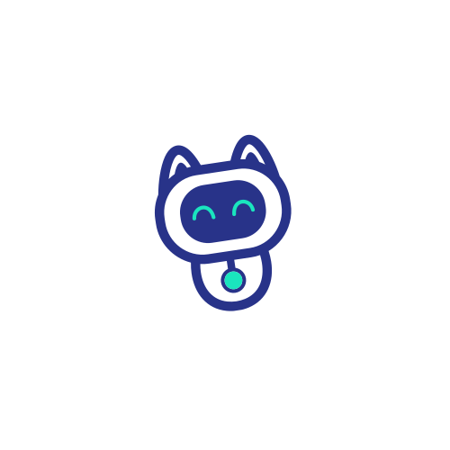

<p align="center">
  
  <h1 align="center">🤖 Neko AI Assistant for WHMCS</h1>
  <p align="center">
    <strong>AI-Powered Ticket Support with Google Gemini — Auto-Reply, Mood Detection, Customer Insights & Smart Escalation</strong>
  </p>
  <p align="center">
    
    
    
    
    
  </p>
</p>

---

## 📋 Table of Contents

- [Overview](#-overview)
- [Features](#-features)
- [Screenshots](#-screenshots)
- [Requirements](#-requirements)
- [Installation](#-installation)
- [Configuration](#-configuration)
- [How It Works](#-how-it-works)
- [Admin Dashboard](#-admin-dashboard)
- [Client Area Features](#-client-area-features)
- [Live Agent Escalation](#-live-agent-escalation)
- [API & Debugging](#-api--debugging)
- [Bangla Documentation](#-বাংলা-ডকুমেন্টেশন)
- [Changelog](#-changelog)

---

## 🌟 Overview

**Neko AI Assistant** is a powerful WHMCS addon module that transforms your support system with Google Gemini AI. It automatically replies to customer tickets, detects mood and sentiment, provides customer-aware personalized responses, and intelligently escalates to human agents when needed — all while giving you full control through an intuitive admin dashboard.

---

## ✨ Features

### 🤖 Core AI Features

| Feature | Description |
|---------|-------------|
| **AI Auto-Reply** | Automatically generates intelligent responses to new tickets and replies using Google Gemini AI |
| **Confidence Scoring** | Every response includes a 0-100% confidence score from Gemini. Only replies above your threshold are sent |
| **Multi-Language** | Generate replies in Auto-Detect, English, or Bangla (বাংলা) |
| **Custom Instructions** | Define custom AI behavior while preserving the system's JSON output format |
| **Configurable Model** | Choose any Gemini model (gemini-1.5-flash, gemini-2.0-flash, gemini-3.1-flash, etc.) |

### 🧠 Intelligence & Context

| Feature | Description |
|---------|-------------|
| **Mood Detection** | Detects customer mood: Angry, Frustrated, Urgent, Satisfied, Calm, Neutral |
| **Customer Insights** | Injects full customer profile (spending, products, domains, ticket history) into AI context |
| **Knowledgebase Search** | Automatically searches WHMCS KB articles for relevant content |
| **QA Pairs** | Manage custom Q&A pairs that are injected into AI context |
| **Ticket Training** | Learns from historical resolved tickets with admin replies |
| **Conversation History** | Considers full ticket thread for context-aware responses |
| **Custom Fields** | Includes ticket custom field values in AI context |

### 🚨 Escalation & Control

| Feature | Description |
|---------|-------------|
| **Live Agent Detection** | Detects 25+ phrases like "live agent", "talk to admin", "human support" |
| **Smart Escalation** | Sets ticket to High Priority, emails admin, notifies customer, keeps ticket Open |
| **Cooldown Bypass** | Live agent requests always bypass the 2-minute cooldown |
| **Mood Escalation** | Auto-escalates when mood worsens across replies (escalation level > 0.8) |
| **Admin Email Alerts** | Sends HTML escalation emails via PHP mail + WHMCS SendAdminEmail API |

### ⚙️ Autopilot & Control

| Feature | Description |
|---------|-------------|
| **Department Filter** | Restrict AI auto-replies to specific department IDs |
| **Delayed Replies** | Queue AI replies with a configurable delay (processed via cron) |
| **Ticket Status Control** | Choose if AI replies mark tickets "Answered" or keep them "Open" |
| **Cooldown Protection** | 2-minute cooldown prevents duplicate auto-replies |
| **AI Footer** | Customizable Markdown footer with optional confidence display |

### 🎨 Admin UI

| Feature | Description |
|---------|-------------|
| **AI Reply Dropdown** | Rich dropdown in admin ticket view: Generate, Rewrite Tone, Enhance, Translate, Summarize, Triage, KB Draft |
| **Analytics Dashboard** | Mood charts, activity graphs, confidence distribution, conversation logs |
| **Admin Widget** | Real-time AI insights widget on WHMCS admin homepage |
| **API Logs** | Full request/response logging with details modal |

---

## 📸 Screenshots

### Admin Dashboard — Overview
*Main dashboard with stats cards, mood distribution chart, and activity timeline*

.png)

### Analytics — Confidence Distribution & Performance
*Confidence breakdown chart and API performance metrics*

.png)

### Knowledge Base — QA Pairs Manager
*Add and manage custom Q&A pairs for AI context*

.png)

### Activity Logs — Recent AI Conversations
*Full log of AI interactions with confidence scores and mood detection*

.png)

### API Logs — Request/Response Tracking
*Detailed API call logs with HTTP codes, response times, and error tracking*

.png)

### Ticket Training
*Train AI from historical resolved tickets with department filtering*

.png)

### Escalation Management
*Track all escalated tickets with admin notification status and resolution*

.png)

### Admin Ticket View — AI Reply Dropdown
*Rich AI reply dropdown with Generate, Rewrite Tone, Enhance, Language, Summarize, Triage, and KB Draft options*

.png)

### Admin Ticket View — AI Processing
*AI processing state with mood and confidence badges*

.png)

### Client Area — AI Reply Dropdown
*Customer-facing AI dropdown with Generate, Summarize, Rewrite Tone, Change Length, and Language options*

.png)

### Live Agent Escalation — Customer Notification
*Automated response when customer requests a live agent*

.png)

### Module Configuration — Core Settings
*API key, model selection, assistant name, confidence threshold, custom instructions*

.png)

### Module Configuration — Advanced Settings
*Training, footer, customer insights, escalation, autopilot, and department settings*

.png)

---

## 📦 Requirements

- **WHMCS** 8.x or later
- **PHP** 7.4 or later
- **Google Gemini API Key** ([Get one here](https://aistudio.google.com/app/apikey))
- **cURL** PHP extension enabled
- **Cron Job** configured in WHMCS (for delayed autopilot replies)

---

## 🚀 Installation

1. **Upload the module:**
   ```
   Upload the `gemini_ai_assistant` folder to:
   /path/to/whmcs/modules/addons/gemini_ai_assistant/
   ```

2. **File structure should be:**
   ```
   modules/addons/gemini_ai_assistant/
   ├── gemini_ai_assistant.php    # Main module file
   ├── hooks.php                  # All hooks and core logic
   ├── FEATURES.txt               # Feature documentation
   ├── README.md                  # This file
   └── assets/                    # Static assets
   ```

3. **Activate the module:**
   - Go to **WHMCS Admin → Setup → Addon Modules**
   - Find **Neko AI Assistant** and click **Activate**
   - Configure the required settings (see below)

4. **Database tables are created automatically** on activation:
   - `mod_gemini_ai_logs` — AI conversation logs
   - `mod_gemini_qa_pairs` — Custom Q&A pairs
   - `mod_gemini_ticket_analysis` — Mood & analysis data
   - `mod_gemini_api_logs` — API call logs
   - `mod_gemini_training_cache` — Training data from historical tickets
   - `mod_gemini_escalations` — Escalation tracking
   - `mod_gemini_reply_queue` — Delayed reply queue

---

## ⚙️ Configuration

Navigate to **Setup → Addon Modules → Neko AI Assistant** and configure:

### Core Settings

| Setting | Default | Description |
|---------|---------|-------------|
| Gemini API Key | — | Your Google Gemini API key |
| Gemini Model | `gemini-1.5-flash` | Which Gemini model to use |
| Assistant Name | `Hostneko` | Name displayed on AI replies |
| Auto Reply | Yes | Enable/disable automatic replies |
| Confidence Threshold | `0.7` | Minimum confidence (0.1–1.0) for auto-reply |
| Max Response Length | `500` | Maximum tokens for AI responses |
| AI Temperature | `0.7` | Creativity level (0.1 = consistent, 1.0 = creative) |
| Custom Instructions | — | Custom behavior instructions for the AI |

### Autopilot Settings

| Setting | Default | Description |
|---------|---------|-------------|
| Autopilot Departments | — | Comma-separated department IDs (blank = all) |
| Autopilot Delay | `0` | Minutes to wait before sending (0 = instant) |
| Autopilot Ticket Status | `Answered` | Ticket status after AI reply |

### Footer & Display

| Setting | Default | Description |
|---------|---------|-------------|
| Show AI Footer | Yes | Display footer under AI replies |
| AI Footer Text | `---\n**This response was generated by AI Assistant**` | Custom footer (Markdown supported) |
| Show Confidence Level | Yes | Show confidence % in footer |

### Training & Insights

| Setting | Default | Description |
|---------|---------|-------------|
| Enable Ticket Training | Yes | Learn from resolved tickets |
| Enable Customer Insights | Yes | Include customer profile data in AI context |
| Training Tickets Limit | `1000` | Number of historical tickets to scan |

### Escalation

| Setting | Default | Description |
|---------|---------|-------------|
| Admin Notification Email | — | Email for escalation alerts |
| Auto-Notify Admin | Yes | Send email + notify client on escalation |

---

## 🔄 How It Works

```
Customer Opens Ticket / Replies
         │
         ▼
  ┌─────────────────┐
  │ "Live Agent"     │──YES──▶ Escalate to Admin
  │  detected?       │         (Email + Flag + Open)
  └────────┬────────┘
           │ NO
           ▼
  ┌─────────────────┐
  │ Cooldown active? │──YES──▶ Skip (wait 2 min)
  └────────┬────────┘
           │ NO
           ▼
  ┌─────────────────┐
  │ Analyze mood,    │
  │ confidence,      │
  │ escalation level │
  └────────┬────────┘
           │
           ▼
  ┌─────────────────┐
  │ Confidence ≥     │──NO──▶ Skip auto-reply
  │ threshold?       │
  └────────┬────────┘
           │ YES
           ▼
  ┌─────────────────┐
  │ Department in    │──NO──▶ Skip auto-reply
  │ autopilot list?  │
  └────────┬────────┘
           │ YES
           ▼
  ┌─────────────────┐
  │ Delay > 0?       │──YES──▶ Queue for cron
  └────────┬────────┘
           │ NO
           ▼
  ┌─────────────────┐
  │ Generate AI      │
  │ response via     │
  │ Gemini API       │
  └────────┬────────┘
           │
           ▼
  ┌─────────────────┐
  │ Send reply via   │
  │ WHMCS API        │
  │ (triggers email) │
  └─────────────────┘
```

---

## 📊 Admin Dashboard

Access via **Addon Modules → Neko AI Assistant** for:

- **📈 Overview Cards** — Total replies, avg confidence, escalations, active QA pairs
- **🍩 Mood Distribution** — Doughnut chart of customer moods
- **📉 Activity Timeline** — Line graph of AI responses over 7 days
- **📊 Confidence Chart** — Bar chart: High/Medium/Low confidence distribution
- **💬 Recent Conversations** — Table with message, AI response, mood, confidence, date
- **📋 QA Pairs Manager** — Add, edit, delete Q&A pairs with priority
- **🎓 Training Tab** — Train AI from historical tickets
- **🚨 Escalation Tab** — View all escalation logs
- **🔧 API Logs** — Inspect every API call with request/response details

| Dashboard | Analytics | Escalations |
|-----------|-----------|-------------|
| .png) | .png) | .png) |

---

## 👤 Client Area Features

Customers see an **AI Reply dropdown** on their ticket view with:
- Generate Reply & Summarize
- Tone rewriting (Formal, Friendly, Empathetic, Firm)
- Length adjustment (Longer, Shorter, Polish)
- Language selection (Auto, English, Bangla)

A helpful banner informs users: *"If you want a real agent to assist you, please write **'live agent'** in your reply."*

.png)

---

## 🚨 Live Agent Escalation

When a customer uses any of the **25+ trigger phrases**, the system:

1. ✅ **Bypasses** the 2-minute cooldown (never blocked)
2. ✅ **Stops** AI auto-reply for this ticket
3. ✅ **Sets** ticket priority to **High**
4. ✅ **Flags** ticket for admin attention
5. ✅ **Sends** HTML email alert to admin(s)
6. ✅ **Notifies** customer with confirmation message
7. ✅ **Keeps** ticket status as **Open** (never "Answered")
8. ✅ **Logs** escalation in database

**Supported trigger phrases include:**
`live agent` · `talk to admin` · `human support` · `real person` · `manager` · `supervisor` · `escalate` · `stop bot` · `no bot` · `i want a human` · and 15+ more

.png)

---

## 🔧 API & Debugging

- **Retry Logic:** Up to 3 attempts with exponential backoff for HTTP 429/503
- **Full Logging:** Every API call logged with endpoint, request, response, timing
- **Debug Mode:** Toggle detailed logging from module settings
- **Log Viewer:** Inspect individual API calls from the dashboard

---

## 🇧🇩 বাংলা ডকুমেন্টেশন

### সংক্ষিপ্ত বিবরণ

**নেকো AI অ্যাসিস্ট্যান্ট** হলো WHMCS-এর জন্য একটি শক্তিশালী অ্যাডঅন মডিউল যা Google Gemini AI দিয়ে আপনার সাপোর্ট সিস্টেমকে রূপান্তরিত করে।

### প্রধান ফিচারসমূহ

- 🤖 **স্বয়ংক্রিয় AI উত্তর** — গ্রাহকের টিকেটে তৎক্ষণাৎ বুদ্ধিমান উত্তর
- 😊 **মুড শনাক্তকরণ** — গ্রাহকের আবেগ বিশ্লেষণ (রাগান্বিত, হতাশ, শান্ত ইত্যাদি)
- 📊 **কনফিডেন্স স্কোর** — প্রতিটি উত্তরে নিশ্চয়তার মাত্রা
- 👤 **কাস্টমার ইনসাইটস** — গ্রাহকের প্রোফাইল, ব্যয়, পণ্য তথ্য AI-তে প্রেরণ
- 🚨 **লাইভ এজেন্ট এসকেলেশন** — "live agent" লিখলে তৎক্ষণাৎ অ্যাডমিনকে জানানো হয়
- 📧 **অ্যাডমিন ইমেইল অ্যালার্ট** — এসকেলেশনে সুন্দর HTML ইমেইল
- 🎓 **টিকেট ট্রেনিং** — পুরোনো টিকেট থেকে AI শেখে
- 📚 **নলেজবেজ সার্চ** — WHMCS KB আর্টিকেল থেকে তথ্য ব্যবহার
- 🌐 **বাংলা সমর্থন** — বাংলায় উত্তর তৈরি করতে পারে
- ⚙️ **অটোপাইলট মোড** — নির্দিষ্ট বিভাগে AI সক্রিয় করুন

### ইনস্টলেশন

1. `gemini_ai_assistant` ফোল্ডারটি `/modules/addons/` এ আপলোড করুন
2. WHMCS অ্যাডমিন → Setup → Addon Modules এ যান
3. **Neko AI Assistant** খুঁজুন এবং **Activate** ক্লিক করুন
4. আপনার Gemini API Key এবং অন্যান্য সেটিংস কনফিগার করুন

### লাইভ এজেন্ট ব্যবহার

গ্রাহকরা যদি মানব সাপোর্ট চান, তারা নিম্নলিখিত যেকোনো বাক্যাংশ লিখতে পারেন:
- "live agent"
- "talk to admin"
- "human support"
- "manager"
- "escalate"
- এবং আরো ২০+

এটি লিখলে:
- AI উত্তর দেওয়া বন্ধ করে
- টিকেট High Priority হয়
- অ্যাডমিনকে ইমেইল পাঠায়
- গ্রাহককে নিশ্চিতকরণ বার্তা দেয়
- টিকেট "Open" থাকে

---

## 📝 Changelog

### v3.0 (Latest)
- ✅ Google Gemini AI integration
- ✅ Auto-reply with confidence scoring
- ✅ Mood detection & sentiment analysis
- ✅ Customer insights (profile-aware AI)
- ✅ Ticket training from history
- ✅ WHMCS Knowledgebase search integration
- ✅ Live agent escalation with 25+ trigger phrases
- ✅ Admin & client area AI reply dropdowns
- ✅ Autopilot mode with department filtering
- ✅ Delayed reply queue (cron-based)
- ✅ Admin notification emails (dual delivery)
- ✅ Analytics dashboard with charts
- ✅ Admin home widget
- ✅ Multi-language support (English, Bangla)
- ✅ QA Pairs management
- ✅ API call logging with retry logic
- ✅ Cooldown protection with escalation bypass
- ✅ Configurable AI footer with confidence display

---

<p align="center">
  <strong>Developed by AI Assistant Pro</strong><br>
  <em>Neko AI Assistant v3.0 — Making Support Smarter 🐱</em>
</p>
